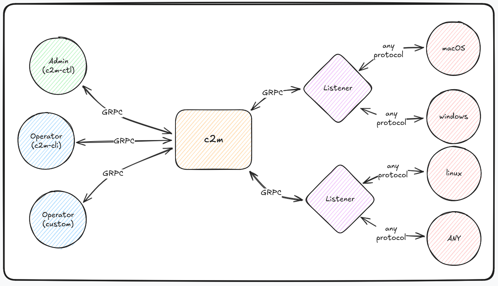

# c2m

`c2m` is a c2 framework that allows you to connect your own listeners and payloads, written in any programming language and utilizing any communication protocol.

Unlike traditional solutions such as Cobalt Strike, `c2m` does not provide ready-made listeners or payload generators. Instead, you have full control over their development: you can create your own listener and payload, implement a suitable communication protocol, and then connect them to `c2m` via a convenient gRPC API.

### Advantages of c2m

- **Maximum Customization:** The "build-it-yourself" approach enables flexible adaptation of the framework to specific tasks and scenarios.
- **Reduced Detection Risk:** You can develop unique payloads using any programming language and include only the features you need. This minimizes the presence of known IoCs.
- **Freedom of Protocol Choice:** Support for any communication protocol for interaction between listeners and payloads.
- **Built-in Scripting Language:** `c2m` includes its own scripting language, [mlan](https://github.com/c2micro/mlan), designed for task automation.
- **Convenient API:** Easy integration through a gRPC API simplifies the connection of your components. You can even create your own custom client to interact with `c2m`.
